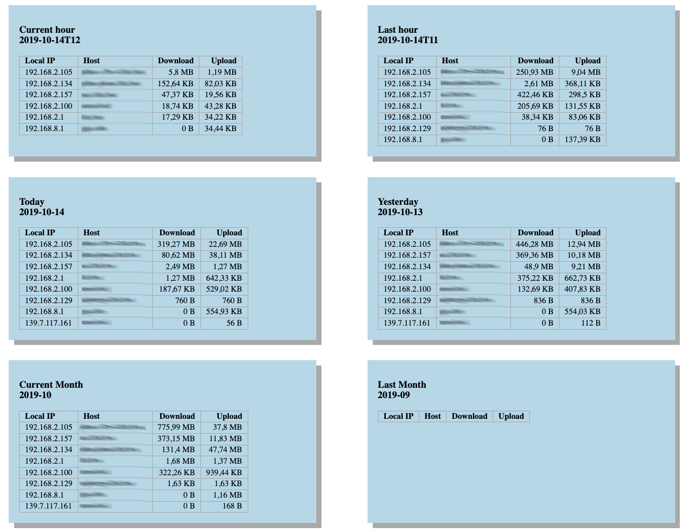

pithu's Fritz!Box Capture
==================

# Motivation

Docker image that monitors Fritz!Box network data volume, per local ip. 

# Usage

```bash
docker build -t pithu/fritz-capture --build-arg FRITZ_USER=$FRITZ_USER --build-arg FRITZ_PWD=$FRITZ_PWD .
```
```bash
docker run -p 8080:80 pithu/fritz-capture
```

then open http://localhost:8080/_index.html.

## Use with persistent monitor data

```bash
docker volume create pithu-capture-data
docker run -d -v pithu-capture-data:/opt/pithu-fritz-capture/www/data -p 8080:80 pithu/fritz-capture 
```
 
## Use docker restart option

wget/ tshark fails from time to time, therefore it is recommend 
to run the docker container with the `--restart unless-stopped` option. 
 
# Configuration

Fritz!Box must be accessible per basic auth.

Docker build args and there default values:

- FRITZ_USER: user for basic auth, default is `admin`.
- FRITZ_PWD: password for basic auth.
- FRITZ_URI: url where to reach the Fritz!Box in the local network, 
  default is `http://fritz.box`.
- FRITZ_IFACE: Fritz!Box interface to capture, default is `2-0`.
- DNS_SERVER: ip of dns server that can resolve local ip addresses, 
  typically the ip of your router. 
  It's required to resolve local host names for local ips,
  default is `192.168.2.1`.

# Screenshots

Screenshot of the application (http://localhost:8080/_index.html)


